# No Code Portfolio

A sophisticated personal website optimized for the AI era — launch a premium portfolio and link‑in‑bio in under 30 minutes, 100% free, with no forced branding.

Support My Work: [https://paystack.shop/pay/matscode](https://paystack.shop/pay/matscode)


Demos: [Product Designer](https://bombay-sigma.vercel.app)

## Use Cases

- Creator link-in-bio for videos, resources, and community links
- Personal portfolio for client work, products, or creative projects
- One-page brand site for agencies, studios, or freelancers
- Lightweight CV site with experience, projects, and contact

## Features

- No-code editing for all content
- Custom sections for projects, experience, and links
- Light and dark themes with polished layouts
- SEO-ready metadata and social sharing
- Fast, mobile-optimized experience

## Deploying Your Personal Website

Before you start, you’ll need free accounts on [GitHub.com](https://github.com) and [Vercel.com](https://vercel.com). GitHub stores your portfolio content, and Vercel hosts the live site. It’s a simple setup, and both are free.

### Steps

#### Step 1: Create the Vercel project

Click Deploy with Vercel to create your copy. When Vercel asks for a project name, use **no-code-portfolio** so your repo stays clean and consistent.

<a href="https://vercel.com/new/clone?repository-url=https://github.com/matscode/no-code-portfolio&project-name=no-code-portfolio&repository-name=no-code-portfolio">
  
</a>

<br />

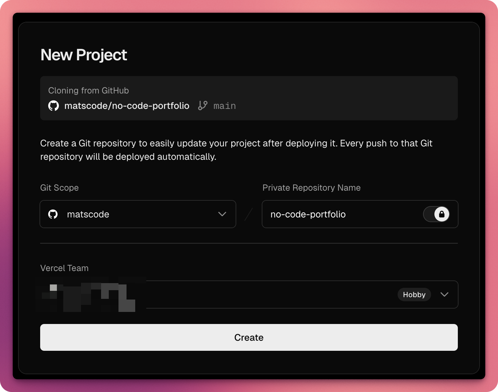

#### Step 2: Confirm the first deploy is successful

Wait for the initial deployment to complete, then click **Continue to Dashboard**.

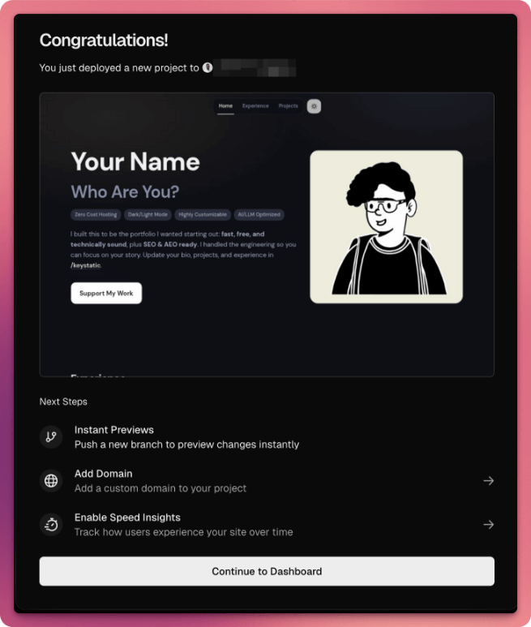

#### Step 3: Open the project dashboard

In the dashboard, click the **+** button next to **Domains** so you can pick your own **vercel.app** address for the site you just deployed. If you want to see the site right away, click the current **vercel.app** link in the Domains list to open it in a new tab.


#### Step 4: Choose your domain

Pick a free `vercel.app` domain or connect a custom domain. If you want a custom domain, follow Vercel’s official guide.

[Vercel domain setup guide](https://vercel.com/docs/projects/domains)
Need a domain? Use my referral link: [https://www.hello.cv/?via=mat](https://www.hello.cv/?via=mat)

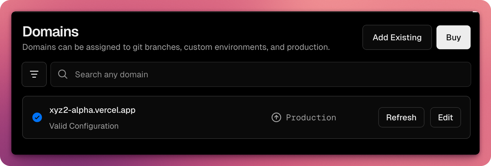

#### Step 5: Edit the domain

Click **Edit**, type your preferred name, and save. If the name is unavailable, try another.

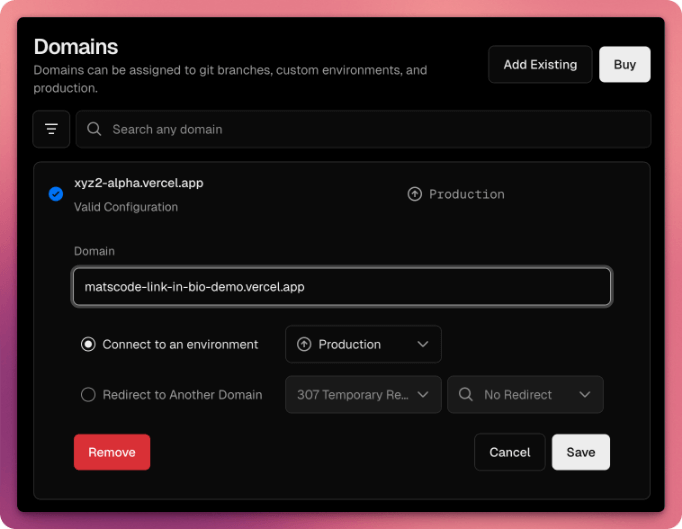

#### Step 6: Confirm the domain swap

Select **Remove old domain** and save.

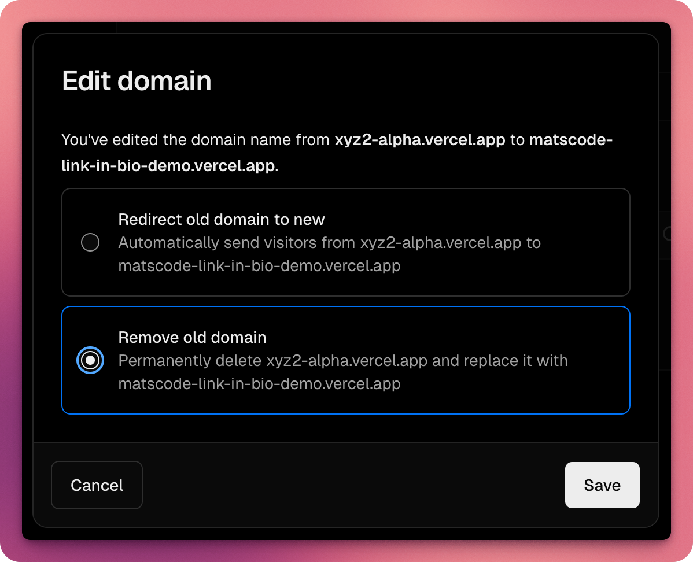

#### Step 7: Create a GitHub app

You’re creating a GitHub app so you can enable a secure login on your website where you can manage your information.

Create a new GitHub App manually (no manifest):

[Create a GitHub App](https://github.com/settings/apps/new)

Fill in:
- GitHub App name (example: <your-username> NCP App)
- Homepage URL: https://your-domain.com (use the domain you set in Step 6)
- Callback URL: https://your-domain.com/api/keystatic/github/oauth/callback (use the same domain from Step 6)
- Webhook: Disable (enabled by default)
- Repository permissions:
  - Contents: Read & write
  - Metadata: Read-only
  - Pull requests: Read-only

Create the app, then generate a Client Secret (it is not created automatically). Copy the Client ID, Client Secret, and App Slug for safe keeping. You will use them in the next step.

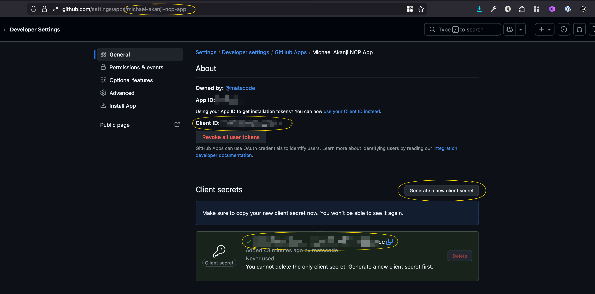

Install the GitHub App on your account and grant it access to the project you created in Step 1 (recommended name: no-code-portfolio). Selecting only that repository adds extra layer of github account security, but all repositories is the fastest option.

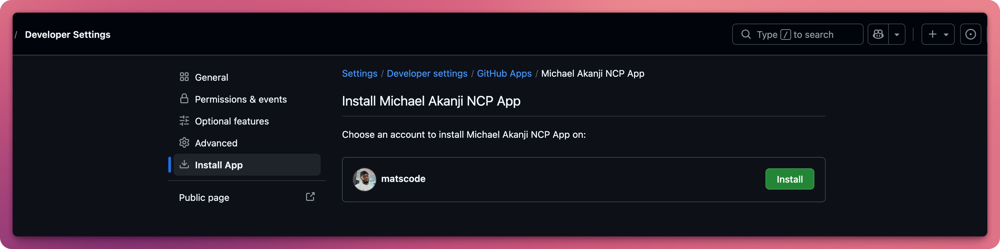
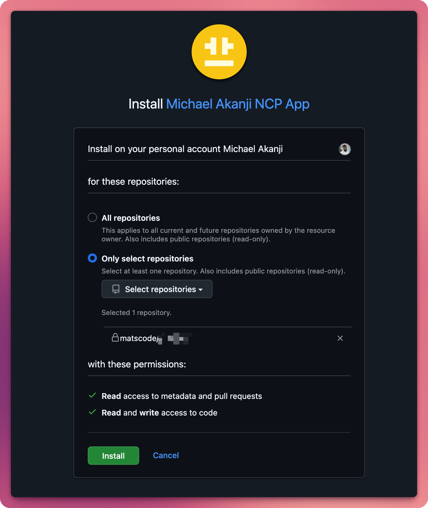

#### Step 8: Add initial environment variables

Environment variables are private settings your site needs to connect to GitHub, so your admin dashboard can save updates you make to your information.

Generate a KEYSTATIC_SECRET (at least 32 characters) using a password generator:

[1Password password generator](https://1password.com/password-generator/)

Open Vercel → your deployed project from Step 6 → Settings → Environment Variables.

Copy this block, replace the placeholders with your own values, then paste the whole block into the Environment Variables form so it auto-fills the keys and values. Ignore the # and anything after it.

```env
NEXT_PUBLIC_NCP_APP_URL=https://your-domain.com # domain from Step 6
NEXT_PUBLIC_NCP_STORAGE_KIND=github # keep as github
NEXT_PUBLIC_NCP_GITHUB_USERNAME=your-github-username # your GitHub username
NEXT_PUBLIC_NCP_REPO_NAME=no-code-portfolio # project name from Step 1
KEYSTATIC_GITHUB_CLIENT_ID=from-github-app # from the GitHub app
KEYSTATIC_GITHUB_CLIENT_SECRET=from-github-app # from the GitHub app
KEYSTATIC_SECRET=generated-strong-secret # from the generator above
NEXT_PUBLIC_KEYSTATIC_GITHUB_APP_SLUG=from-github-app # from the GitHub app
```

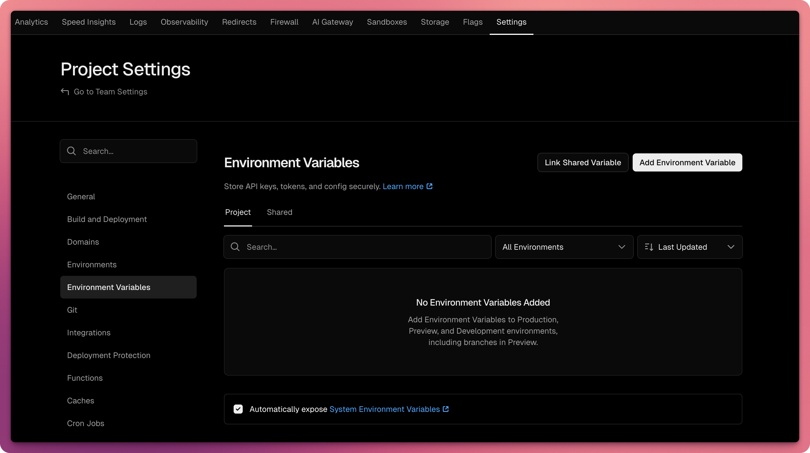
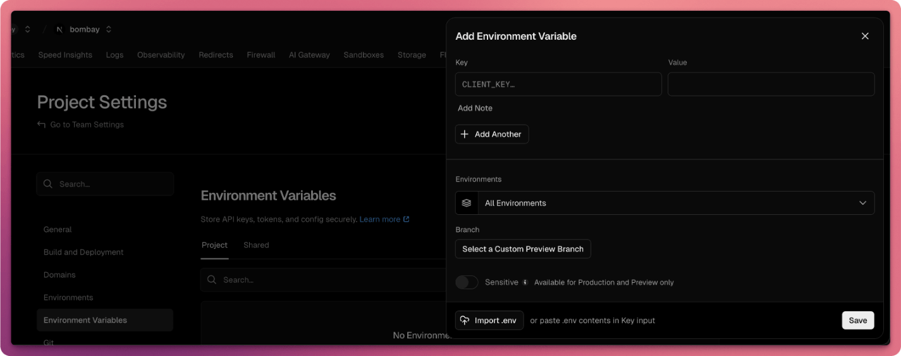
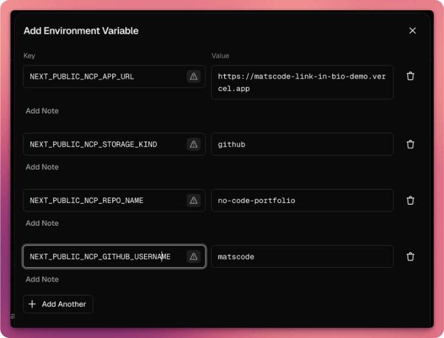

#### Step 9: Redeploy your website

Open Vercel → your project → Deployments. Find the most recent deployment and click **Redeploy** so all the new configurations take effect.

#### Step 10: Launch and edit your site

Open https://your-domain.com/keystatic (replace with your real domain). Sign in with GitHub, approve the app, then you’ll land on your admin dashboard where you can update your personal information for your website.

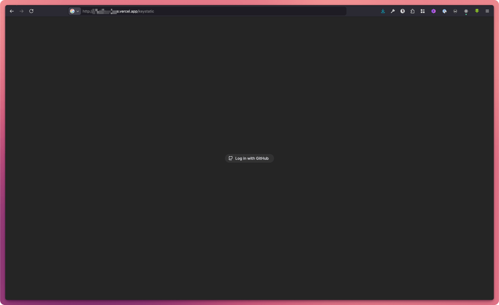
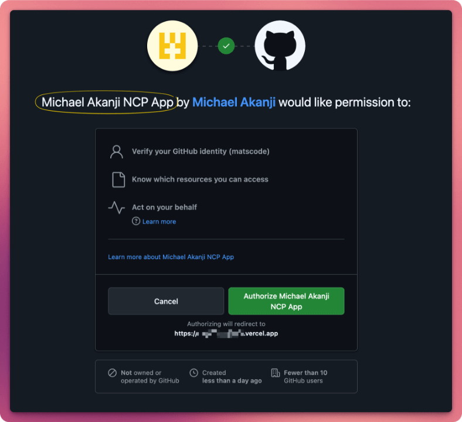
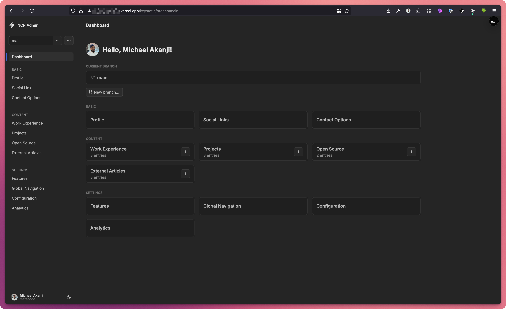

#### Optional: Switch to a custom domain later

If you want a custom domain (like yourname.com or yourname.cv), you can buy one here: [https://www.hello.cv/?via=mat](https://www.hello.cv/?via=mat), then follow Vercel’s guide to connect the domain to your website:
https://vercel.com/docs/projects/domains

After the domain is connected, open your GitHub App settings and update these two fields:
- Homepage URL → https://your-domain.com
- Callback URL → https://your-domain.com/api/keystatic/github/oauth/callback

Then update `NEXT_PUBLIC_NCP_APP_URL` in Vercel to the same domain and redeploy.

Support My Work: [https://paystack.shop/pay/matscode](https://paystack.shop/pay/matscode)

## Customization

Optional: Use this section only if you want to customize or tinker with the project. It is not part of the setup steps.

See ENGINEERING_README.md for local development and customization.
