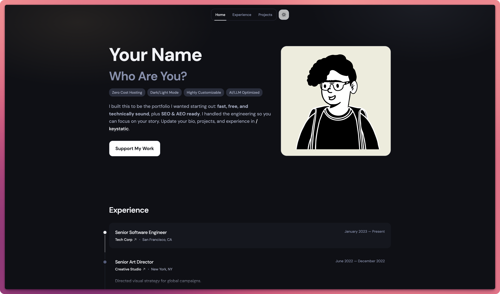
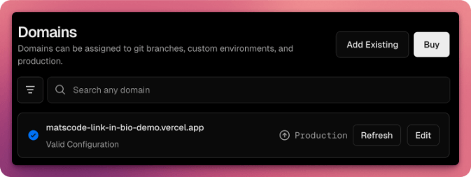

# No Code Portfolio

A sophisticated personal website optimized for the AI era — launch a premium portfolio and link‑in‑bio in under 30 minutes, 100% free, with no forced branding.

## Use Cases

- Creator link-in-bio for videos, resources, and community links
- Personal portfolio for client work, products, or creative projects
- One-page brand site for agencies, studios, or freelancers
- Lightweight CV site with experience, projects, and contact

## Features

- No-code editing for all content
- Custom sections for projects, experience, and links
- Light and dark themes with polished layouts
- SEO-ready metadata and social sharing
- Fast, mobile-optimized experience

## Deploying Your Personal Website

### Steps

#### Step 1: Create the Vercel project

Click Deploy with Vercel to create your copy. When Vercel asks for a project name, use **no-code-portfolio** so your repo stays clean and consistent.

[](https://vercel.com/new/clone?repository-url=https://github.com/matscode/no-code-portfolio&project-name=no-code-portfolio&repository-name=no-code-portfolio)


#### Step 2: Confirm the first deploy is successful

Wait for the initial deployment to complete.



#### Step 3: Open the project dashboard

In the dashboard, click the **+** button beside Domains to manage your live URL.


#### Step 4: Choose your domain

Pick a free `vercel.app` domain or connect a custom domain. If you want a custom domain, follow Vercel’s official guide.

[Vercel domain setup guide](https://vercel.com/docs/projects/domains)


#### Step 5: Edit the domain

Click **Edit**, type your preferred name, and save. If the name is unavailable, try another.


#### Step 6: Confirm the domain swap

Select **Remove old domain** and save.


#### Step 7: Verify the new domain

You should now see the new domain. Click it to preview your site. The site is live, but keep going to secure your admin and update content.



#### Step 8: Preview the live site

Open your live site to confirm it loads correctly.


#### Step 9: Create your GitHub App

Create a new GitHub App manually (no manifest):

[Create a GitHub App](https://github.com/settings/apps/new)

Fill in:
- GitHub App name (example: <Your Name> NCP App)
- Homepage URL: https://your-domain.com (use the domain you set in Step 8)
- Callback URL: https://your-domain.com/api/keystatic/github/oauth/callback (use the same domain from Step 8)
- Webhook: Disable (enabled by default)
- Repository permissions:
  - Contents: Read & write
  - Metadata: Read-only
  - Pull requests: Read-only

Create the app, then generate a Client Secret (it is not created automatically). Copy the Client ID, Client Secret, and App Slug for safe keeping. You will use them in the next step.

Install the GitHub App on your account and grant it access to the project you created in Step 1 (recommended name: no-code-portfolio).

#### Step 10: Add initial environment variables

Generate a KEYSTATIC_SECRET (at least 32 characters) using a password generator:

[1Password password generator](https://1password.com/password-generator/)

Open Vercel → your deployed project from Step 8 → Settings → Environment Variables.

Replace the placeholders with your own values, then paste the whole block into the Environment Variables form so it auto-fills the keys and values:

```env
NEXT_PUBLIC_NCP_APP_URL=https://your-domain.com
NEXT_PUBLIC_NCP_STORAGE_KIND=github
NEXT_PUBLIC_NCP_GITHUB_USERNAME=your-github-username
NEXT_PUBLIC_NCP_REPO_NAME=no-code-portfolio
KEYSTATIC_GITHUB_CLIENT_ID=from-github-app
KEYSTATIC_GITHUB_CLIENT_SECRET=from-github-app
KEYSTATIC_SECRET=generated-strong-secret
NEXT_PUBLIC_KEYSTATIC_GITHUB_APP_SLUG=from-github-app
```

Where the values come from:
- NEXT_PUBLIC_NCP_APP_URL: the domain you set in Step 8
- NEXT_PUBLIC_NCP_GITHUB_USERNAME: your GitHub username
- NEXT_PUBLIC_NCP_REPO_NAME: the project name you chose in Step 1 (recommended: no-code-portfolio)
- KEYSTATIC_GITHUB_CLIENT_ID, KEYSTATIC_GITHUB_CLIENT_SECRET, NEXT_PUBLIC_KEYSTATIC_GITHUB_APP_SLUG: your GitHub App details
- KEYSTATIC_SECRET: the generated value from the password generator (at least 32 characters)

#### Step 11: Redeploy with the new env vars

Redeploy in Vercel so the environment variables take effect.

#### Step 12: Launch and edit your site

Open your website and visit /keystatic to update your content.

## Customization

Optional: Use this section only if you want to customize or tinker with the project. It is not part of the setup steps.

See ENGINEERING_README.md for local development and customization.
